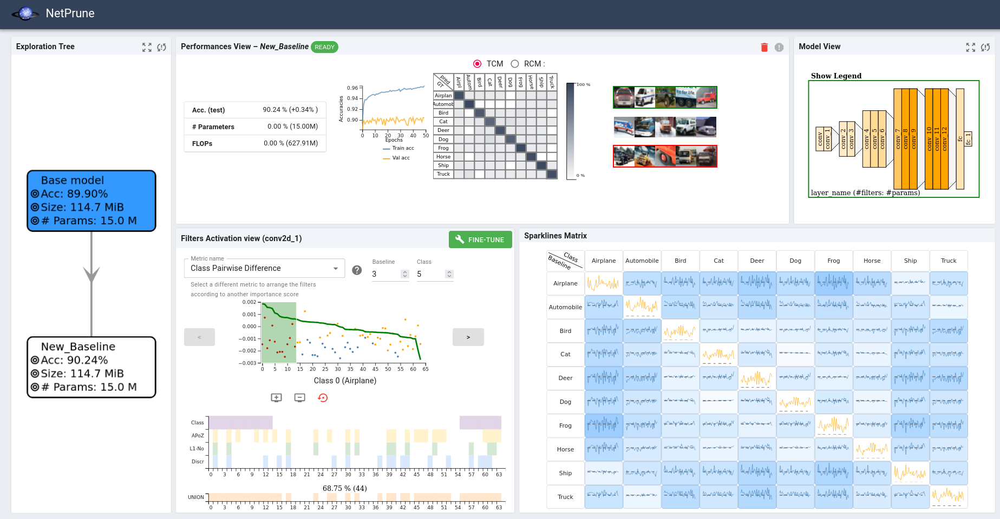
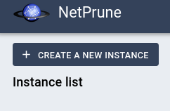
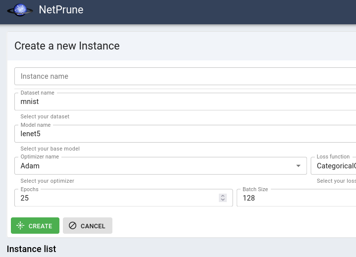

# NetPrune

Implementation of NetPrune, a visual analytics tool to explore the architecture and the sub architectures of deep neural networks; 
to analyze the behavior of the filters (and neurons) relatively to four metrics. 
For now, NetPrune targets classification tasks with images. 

Overview of NetPrune: 




# Installation

## Server side

0. In a first terminal: 

1. Create a python virtual environment and install dependancies [_[netprune_server/install.sh](netprune_server/install.sh)_]: 

```
cd ./netprune_server
sh install.sh
```

2. Run the [_[netprune_server/run.sh](netprune_server/install.sh)_] script to start the Flask server. 

```
sh run.sh
```


## Client side

0. In a second terminal:  


1. Install Meteor: 

```
cd ./netprune_client
curl https://install.meteor.com/\?release\=2.16 | sh
```

2. Create a meteor project without replacing the source code and install dependancies [_[netprune_client/install.sh](netprune_client/install.sh)_]: 

```
sh install.sh
```

3. Run the script to start meteor [_[netprune_client/run.sh](netprune_client/run.sh)_]: 

```
sh run.sh
```


# Usage

When the installation is finalized, NetPrune should be running in a browser at:

```
http://localhost:3000/
```
You should then find an empty list of instances, with a button to create a new one. This button will enable you to train a neural network, given one of the possible architectures (you can implement your own with your own dataset of images). 
You can setup a set of hyper-parameters (the most specific ones can be controlled directly in the code: ``./netprune_server/params/``)





# Notes

To visualize the images of the chosen dataset when clicking on the confusion matrix cells in the Performance view, you may need to extract the test subset of images and copy it to the following location: 

```
./netprune_client/public/datasets/<dataset_name>/
```

> ⚠️ **_NB:_** This implementation is a proof of concept. It may contain bugs. 


## Reference

This work has been published at [Visual Informatics in 2023](https://www.sciencedirect.com/science/article/pii/S2468502X23000141). Please cite this work if you use it:

```
@article{pomme2023netprune,
  title={NetPrune: a sparklines visualization for network pruning},
  author={Pomm{\'e}, Luc-Etienne and Bourqui, Romain and Giot, Romain and Vallet, Jason and Auber, David},
  journal={Visual Informatics},
  volume={7},
  number={2},
  pages={85--99},
  year={2023},
  publisher={Elsevier}
}
```
